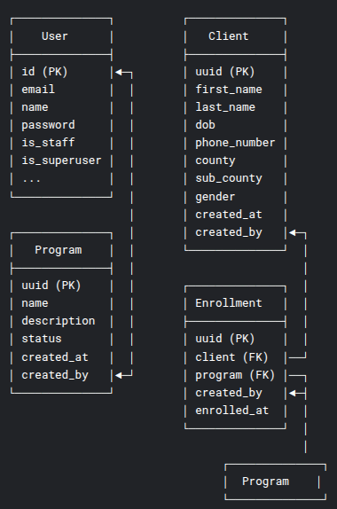

# HealthIS-backend
- Serves the healthIS frontend
- Health Information System

- The API documentation: https://documenter.getpostman.com/view/25116831/2sB2j1hCDs

## ER diagram



## Overview

HealthIS is a simple yet powerful health information system.  
It allows doctors (system users) to:
- Create health programs (e.g., TB, Malaria, HIV)
- Register clients
- Enroll clients into programs
- Search and view client profiles
- Expose client profiles via a secure API


## Features

- ✅ Health Programs CRUD
- ✅ Client Registration and Management
- ✅ Client Enrollment into Programs
- ✅ Global Client Search
- ✅ Client Profile API Exposure
- ✅ Generated Analytics


## Technology Stack

- **Backend:** Django REST Framework
- **Database:** PostgreSQL


## Setup

### Prerequisites
- Python 3.9+
- pip
- Git


### Installation

1. **Clone the repository**

```bash
git clone https://github.com/yourusername/healthis.git
cd healthis
```

2. **Create a virtual environment**

```bash
python -m venv venv
source venv/bin/activate  # On Windows: venv\Scripts\activate
```

3. **Install required packages**

```bash
pip install -r requirements.txt
```

4. **Run migrations**

```bash
python manage.py migrate
```

5. **Create a superuser**

```bash
python manage.py createsuperuser
```

6. **Start the development server**

```bash
python manage.py runserver
```

The app should now be running at:  
`http://127.0.0.1:8000/`

## API Endpoints Overview

| Endpoint | Method | Description |
|:---------|:-------|:------------|
| `/api/v1/clients/` | GET, POST | List all clients / Register new client |
| `/api/v1/clients/<uuid>/` | GET | View specific client profile |
| `/api/v1/programs/` | GET, POST | List/Create health programs |
| `/api/v1/enrollments/` | POST | Enroll client into a program |


## Run tests

```bash
python manage.py test
```
